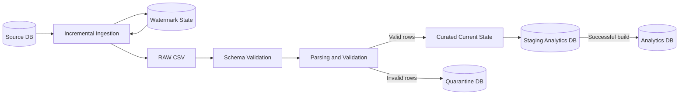

# Daily Sales Data Pipeline


## 1. Visão geral

Pipeline de dados batch desenvolvido para simular o processamento diário de vendas de um e-commerce, desde a extração incremental da origem até a disponibilização de dados tratados para Analytics.

O projeto foi construído com foco nos fundamentos de Engenharia de Dados: ingestão incremental, preservação de dados brutos, idempotência, tratamento de dados inválidos, controle de versões, qualidade de dados, recuperação de falhas e publicação segura da camada analítica.

> Este projeto utiliza SQLite e arquivos CSV para manter o ambiente local simples e reproduzível. O cenário simulado representa uma arquitetura em que a origem transacional seria PostgreSQL, com uma read replica disponível para cargas analíticas.

---
## 2. Problema de negócio

Uma equipe de Analytics depende diariamente de dados de vendas provenientes do sistema transacional de um e-commerce.

O processo existente é manual e envolve consultas e transformações sobre pedidos, itens e outros dados operacionais. Além do custo operacional, esse processo apresenta riscos como perda de atualizações, inconsistências entre execuções, ausência de histórico confiável e dificuldade para identificar problemas de qualidade nos dados.

O pipeline deve disponibilizar os dados no início da manhã, aproximadamente às 09h, sem gerar carga desnecessária sobre o banco transacional.

Pedidos também podem sofrer alterações após sua criação, como cancelamentos ou reembolsos. Portanto, extrair apenas novos registros não é suficiente: o pipeline precisa detectar e processar alterações em registros já existentes.

Além disso, registros individuais com problemas de qualidade não devem necessariamente impedir o processamento de todo o lote. Esses registros precisam ser preservados para investigação sem contaminar a camada analítica.

---
## 3. Requisitos do cenário
| Requisito | Cenário |
|---|---|
| Frequência | Batch diário |
| Disponibilidade esperada | Dados disponíveis por volta das 09h |
| Volume diário | ~10–15 mil pedidos e ~30–50 mil itens |
| Picos | Até aproximadamente 3–5x o volume normal |
| Histórico | Pelo menos 2 anos |
| Alterações posteriores | Pedidos podem ser cancelados, reembolsados ou atualizados |
| Incrementalidade | `updated_at` disponível nas principais tabelas |
| CDC | Não disponível no cenário inicial |
| Banco operacional | PostgreSQL no cenário simulado |
| Proteção da origem | Read replica disponível; evitar carga analítica sobre o banco principal |
| Qualidade | Detectar tanto falhas técnicas quanto registros inválidos |
| Recuperação de falhas | Uma execução com erro não deve destruir o último estado analítico válido |

Para o laboratório local, a origem PostgreSQL foi substituída por SQLite. Essa simplificação permite concentrar o projeto nos problemas de engenharia do pipeline sem introduzir infraestrutura adicional nesta primeira versão.

---

## 4. Arquitetura
O pipeline separa ingestão, persistência RAW, processamento, quarantine e publicação analítica.



### Visão simplificada do fluxo


## 5. Estrutura do projeto
```text
project-01-sales-pipeline/
│
├── data/
│   ├── source/
│   │   └── source.db
│   │
│   ├── raw/
│   │   └── orders/
│   │
│   ├── state/
│   │   └── orders_state.json
│   │
│   ├── curated/
│   │   └── analytics.db
│   │
│   └── quarantine/
│       └── quarantine.db
│
├── src/
│   ├── seed_db.py
│   ├── ingest.py
│   ├── build_curated.py
│   ├── update_source.py
│   ├── check_source.py
│   ├── check_analytics.py
│   └── check_quarantine.py
│
├── tests/
│   └── test_build_curated.py
│
├── README.md
└── .gitignore
```
## 6. Como o pipeline funciona
### 6.1 Ingestão incremental e watermark
Na primeira execução, como ainda não existe um estado anterior, o pipeline realiza uma carga completa da tabela de pedidos.
Depois que os dados são persistidos na camada RAW, o maior updated_at processado é armazenado em: data/state/orders_state.json.
Nas execuções seguintes, esse valor funciona como um watermark.

Em vez de consultar novamente toda a origem, o pipeline busca registros utilizando uma condição equivalente a WHERE updated_at >= ?
O uso de >=, em vez de >, é deliberado.

Durante os testes do projeto foi identificado um failure mode em que um novo registro poderia possuir exatamente o mesmo updated_at do watermark já salvo. Com >, esse registro poderia nunca ser extraído.
A estratégia adotada foi aceitar uma pequena sobreposição entre execuções:
```
watermark anterior
        │
        ▼
updated_at >= watermark
        │
        ▼
alguns registros podem ser lidos novamente
        │
        ▼
downstream precisa ser idempotente
```
Essa decisão prioriza evitar perda silenciosa de dados, mesmo que isso gere duplicação controlada na camada RAW.
O watermark só é avançado depois que os registros extraídos foram persistidos com sucesso no RAW.

### 6.2 RAW
Cada execução que encontra dados gera um novo arquivo CSV em: data/raw/orders/
Os arquivos anteriores não são sobrescritos.

A camada RAW funciona como histórico dos dados recebidos pelo pipeline e permite:

  * reprocessar dados;
  * investigar falhas;
  * reproduzir estados anteriores;
  * desacoplar ingestão e transformação.

Como a estratégia de ingestão utiliza overlap, registros duplicados e múltiplas versões de um mesmo pedido podem existir no RAW.
Essa duplicação é esperada e tratada posteriormente durante a construção da camada curated.

### 6.3 Schema validation
Antes de processar as linhas de um arquivo RAW, o pipeline verifica se as colunas obrigatórias estão presentes.
Entre os campos esperados estão:

    * order_id
    * status
    * amount
    * created_at
    * updated_at

Uma diferença importante é feita entre dois tipos de problemas.
Um arquivo sem uma coluna obrigatória representa uma quebra estrutural do contrato esperado e interrompe o processamento.
Já um problema localizado em uma linha, como um order_id inválido ou um amount incorreto, pode ser isolado na quarantine sem necessariamente invalidar todo o lote.


### 6.4 Parsing e validação
Depois da validação estrutural, cada registro passa por duas etapas conceitualmente diferentes.
O parsing verifica se o dado bruto pode ser interpretado no formato esperado.

Exemplos:

    * order_id precisa ser convertido para inteiro;
    * amount precisa ser numérico;
    * created_at e updated_at precisam possuir timestamps válidos;
    * status não pode estar vazio.

Os timestamps válidos são normalizados para um formato canônico: YYYY-MM-DD HH:MM:SS
A normalização também permite que a comparação de versões por updated_at seja feita de maneira consistente.

**Validação**

Depois que o registro pode ser interpretado, são verificadas regras de validade do dado.
Um exemplo implementado é: amount > 0
Assim, parsing e validação possuem responsabilidades diferentes:

    Parsing responde se o dado pode ser interpretado.

    Validação responde se o dado interpretado satisfaz as regras esperadas.
    
### 6.5 Curated e resolução de versões
Os registros válidos são carregados na tabela: orders_current
A tabela representa o estado atual conhecido de cada pedido.
Como o RAW pode conter duplicatas e versões recebidas fora de ordem, a carga utiliza UPSERT com proteção por updated_at.
Uma versão recebida só substitui a versão existente quando for mais recente.
Conceitualmente:

    - pedido 101 - versão 10:00
    - pedido 101 - versão 15:00
    - pedido 101 - versão 12:00

Mesmo que a versão das 12:00 seja processada depois da versão das 15:00, ela não pode regredir o estado atual do pedido.
A condição utilizada no UPSERT garante que:" incoming.updated_at > current.updated_at " seja necessária para realizar a atualização.
Isso torna o processamento curated idempotente e resistente à chegada fora de ordem de versões antigas

### 6.6 Quarantine
Registros que não podem ser enviados para a camada curated são preservados em: data/quarantine/quarantine.db
A quarantine mantém os valores brutos como texto sempre que possível, permitindo investigar exatamente o conteúdo que causou o problema.

Cada registro contém também informações como:

* código do erro;
* mensagem do erro;
* momento da detecção;
* arquivo de origem;
* quarantine_key.

Exemplos de problemas tratados incluem:

    -INVALID_ORDER_ID_FORMAT
    -INVALID_AMOUNT_FORMAT
    -INVALID_AMOUNT
    -INVALID_CREATED_AT_FORMAT
    -INVALID_UPDATED_AT_FORMAT
    -MISSING_CREATED_AT
    -MISSING_STATUS
    -Identidade dos registros da quarantine

A quarantine também precisa ser idempotente.
Reprocessar o mesmo RAW não deve criar indefinidamente a mesma ocorrência lógica.
Para isso, o pipeline cria uma quarantine_key determinística utilizando SHA-256.
A chave é calculada a partir de campos estáveis do registro:

    * order_id
    * status
    * amount
    * created_at
    * updated_at
    * error_code

Campos como detected_at e source_file não fazem parte da identidade, pois podem mudar entre execuções mesmo quando o problema lógico é o mesmo.

### 6.7 Publicação segura do Analytics
Uma das preocupações do pipeline é evitar que uma falha durante o rebuild destrua a última versão válida dos dados analíticos.
Por isso, o banco oficial não é removido antes do processamento.
Primeiro é construído um banco temporário: analytics_building.db
Somente depois que a construção termina com sucesso o staging substitui a versão oficial.
Essa estratégia protege o consumidor contra um estado parcialmente construído ou contra a remoção do último dataset válido durante uma falha.

## 7. Data Quality e failure modes

O pipeline diferencia problemas estruturais do arquivo, problemas de parsing e violações de regras de validação.
Um erro estrutural, como a ausência de uma coluna obrigatória, interrompe o processamento porque o arquivo deixou de atender ao schema esperado.
Problemas localizados em registros individuais são tratados de forma diferente. Sempre que possível, o registro bruto é preservado na quarantine para investigação posterior, enquanto os demais registros válidos continuam sendo processados.

| Cenário                                         | Comportamento esperado                       |
| ----------------------------------------------- | -------------------------------------------- |
| `order_id` não pode ser convertido para inteiro | Registro enviado para quarantine             |
| `amount` não é numérico                         | Registro enviado para quarantine             |
| `amount <= 0`                                   | Registro enviado para quarantine             |
| `created_at` ausente ou inválido                | Registro enviado para quarantine             |
| `updated_at` inválido                           | Registro enviado para quarantine             |
| `status` ausente                                | Registro enviado para quarantine             |
| Coluna obrigatória ausente no CSV               | Execução falha                               |
| Mesmo RAW é reprocessado                        | Curated e quarantine permanecem idempotentes |
| Versão antiga chega após versão mais recente    | Curated não regride                          |
| Mesmo erro é detectado novamente                | `quarantine_key` evita duplicação lógica     |
| Nova versão problemática do mesmo pedido        | Nova entrada de quarantine é preservada      |
| Rebuild do Analytics falha                      | Analytics anterior permanece disponível      |
| RAW está vazio                                  | Analytics existente não é substituído        |


Essa abordagem segue um princípio importante do projeto: nem toda falha de qualidade possui a mesma gravidade.
Uma linha inválida pode ser isolada. Já uma quebra estrutural do schema pode indicar que o contrato de dados esperado mudou e, por isso, deve impedir a publicação de um novo estado analítico.

## 8. Testes
O projeto possui uma suíte automatizada utilizando pytest.
Estado atual:

  33 tests collected
  33 passed

Os testes cobrem diferentes níveis do processamento, incluindo parsing, validação, UPSERT, idempotência, quarantine e comportamento do pipeline diante de falhas.
Entre os cenários testados estão:

  parsing de valores válidos e inválidos;
  ausência de campos obrigatórios;
  timestamps inválidos;
  valores de amount inválidos;
  inserção de novos pedidos;
  atualização por versões mais recentes;
  proteção contra regressão causada por versões antigas;
  reprocessamento do mesmo RAW;
  múltiplos arquivos RAW com versões fora de ordem;
  idempotência da quarantine;
  order_id = NULL na identidade da quarantine;
  registros distintos com order_id = NULL;
  diferentes erros para o mesmo conteúdo bruto;
  novas versões de um registro já presente na quarantine;
  falha durante construção do Analytics;
  preservação do Analytics anterior;
  RAW vazio;
  lote misto contendo registros válidos e inválidos.

A suíte pode ser executada com: python -m pytest -v

Os testes foram utilizados não apenas para verificar o código final, mas também para reproduzir failure modes encontrados durante o desenvolvimento e evitar regressões após refatorações.

## 9. Principais decisões de engenharia

Incremental por updated_at em vez de CDC

O cenário possui volume diário moderado, processamento batch e campos updated_at disponíveis nas principais tabelas.
Embora CDC fosse uma alternativa possível, adicionaria complexidade operacional desnecessária para a primeira versão.
Por isso, a implementação utiliza extração incremental baseada em watermark.

Trade-off: a solução é mais simples, mas depende da qualidade e confiabilidade do updated_at fornecido pela origem.
Overlap com >= em vez de >

Inicialmente, a ingestão utilizava: updated_at > watermark

Durante os testes foi identificado que um registro com timestamp exatamente igual ao watermark poderia nunca ser extraído.
A condição foi alterada para: updated_at >= watermark

Isso cria uma pequena sobreposição entre execuções.
A decisão foi aceitar duplicação controlada em vez de correr o risco de perda silenciosa de dados.
Essa escolha exige que as etapas downstream sejam idempotentes.

RAW preservado

Os arquivos RAW não são sobrescritos a cada execução.
Essa decisão permite reprocessamento, investigação e reprodução dos dados recebidos pelo pipeline.
Como consequência, o RAW pode conter múltiplas versões e registros repetidos.
A camada curated é responsável por resolver essas duplicações.

UPSERT protegido por versão
A tabela orders_current representa o estado atual conhecido de cada pedido.
Uma atualização só ocorre quando a versão recebida possui: incoming.updated_at > current.updated_at
Isso impede que uma versão antiga processada posteriormente substitua um estado mais recente.

Quarantine para problemas localizados

Um único registro inválido não deve necessariamente impedir a disponibilização de milhares de registros válidos.
Por isso, erros localizados são direcionados para uma quarantine persistente.
O dado bruto é preservado sempre que possível para facilitar investigação e remediação.

Identidade determinística da quarantine
Utilizar apenas: order_id + updated_at + error_code não foi suficiente para garantir idempotência, especialmente quando valores NULL estavam presentes.
A solução adotada foi criar uma quarantine_key utilizando SHA-256 sobre uma representação determinística de:

    - order_id
    - status
    - amount
    - created_at
    - updated_at
    - error_code

Assim, a identidade não depende das regras de comparação de NULL do banco.
Campos como detected_at e source_file foram deliberadamente excluídos da chave porque podem variar entre reprocessamentos do mesmo problema lógico.

Staging antes da publicação

O pipeline não remove o Analytics válido antes de construir o próximo estado.
A nova versão é criada primeiro em um banco temporário.
Somente após o processamento bem-sucedido ela substitui o banco oficial.
Essa decisão reduz o risco de indisponibilidade causada por uma execução parcialmente concluída.

## 10. Limitações da V1 e próximas evoluções

Limitações da V1

Esta implementação foi deliberadamente mantida simples para concentrar o projeto nos fundamentos de Engenharia de Dados.

SQLite como ambiente de laboratório

O cenário de negócio considera PostgreSQL e uma read replica, mas o laboratório utiliza SQLite.
Isso torna o projeto reproduzível localmente sem exigir infraestrutura adicional.
A implementação, portanto, não pretende reproduzir características operacionais específicas de PostgreSQL, como concorrência, replicação ou comportamento sob carga real.

Sem atomicidade entre Analytics e Quarantine

Analytics e Quarantine são bancos SQLite separados.
Isso significa que não existe uma única transação capaz de confirmar ou desfazer alterações nos dois bancos simultaneamente.
Por exemplo, é possível que a quarantine seja persistida e uma falha posterior impeça a promoção do novo Analytics.
Essa limitação é conhecida na V1.

Full rebuild da camada analítica

A construção do Analytics reprocessa os arquivos RAW para reconstruir o estado atual.
Essa estratégia é adequada para o volume do laboratório e simplifica o raciocínio sobre idempotência e recuperação.
Para volumes significativamente maiores, seria necessário avaliar processamento incremental também nessa etapa.

Empate de updated_at

A resolução de versões depende de updated_at.
Quando duas versões diferentes possuem exatamente o mesmo timestamp, o pipeline não possui atualmente uma segunda chave de desempate proveniente da origem.
Esse é um limite do contrato disponível nesta versão.
Ausência de orquestração e observabilidade operacional
A V1 não utiliza Airflow, Dagster ou outro orquestrador.
Também não possui métricas, alertas, dashboards ou monitoramento de freshness em produção.
As falhas são tratadas no nível do processamento e validadas por testes, mas uma evolução real de produção exigiria observabilidade operacional.

Concorrência

O pipeline foi projetado para uma única execução por vez.
O caminho temporário utilizado para construir o Analytics não foi projetado para múltiplas execuções concorrentes.

Possíveis evoluções

Uma evolução do projeto poderia incluir PostgreSQL real com read replica, execução incremental da camada curated, orquestração, métricas de qualidade e freshness, logging estruturado, alertas, reconciliação com métricas financeiras, CI/CD e execução em infraestrutura cloud.
Essas melhorias não foram adicionadas à V1 porque o objetivo desta etapa foi resolver primeiro os problemas fundamentais do pipeline com a menor complexidade necessária.

## 11. Tecnologias utilizadas

O projeto foi desenvolvido com ferramentas simples para manter o foco nos fundamentos do pipeline e permitir execução local sem infraestrutura externa.
| Tecnologia | Uso no projeto                                            |
| ---------- | --------------------------------------------------------- |
| Python     | Ingestão, transformação, validação e controle do pipeline |
| SQLite     | Simulação da origem transacional, Analytics e Quarantine  |
| CSV        | Persistência da camada RAW                                |
| JSON       | Persistência do watermark                                 |
| SQL        | Consulta da origem e UPSERT da camada curated             |
| SHA-256    | Geração da identidade determinística da quarantine        |
| pytest     | Testes automatizados                                      |
| pathlib    | Manipulação de caminhos e arquivos                        |

## 12. Como executar

1. Clonar o repositório
git clone <https://github.com/BuenoCamargo/Daily-Sales-Data-Pipeline/tree/main>
cd project-01-sales-pipeline

Por enquanto deixe <https://github.com/BuenoCamargo/Daily-Sales-Data-Pipeline/tree/main> assim. 

2. Criar o ambiente virtual
python -m venv .venv

No Windows PowerShell:

.\.venv\Scripts\Activate.ps1
3. Instalar dependências de desenvolvimento
python -m pip install pytest

Se criarmos um requirements-dev.txt antes da publicação, podemos substituir depois por:

python -m pip install -r requirements-dev.txt

Eu acho que vale a pena fazermos isso na preparação final do repositório.

4. Criar a base de origem do laboratório
python src\seed_db.py

Esse script inicializa o banco SQLite que simula o sistema transacional.

O seed_db.py pertence ao ambiente de laboratório e recria a base de origem para permitir execuções reproduzíveis. Esse comportamento não representa como um pipeline de produção manipularia um banco operacional real.

5. Executar a ingestão
python src\ingest.py

Na primeira execução, o pipeline realiza a carga inicial e cria o watermark.

Nas execuções seguintes, a extração passa a utilizar o estado salvo em:

data/state/orders_state.json

Os dados extraídos são armazenados como novos arquivos em:

data/raw/orders/
6. Construir a camada analítica
python src\build_curated.py

O processamento lê os arquivos RAW, executa validação de schema, parsing e validação dos registros.

Registros válidos são utilizados para construir o estado atual de pedidos e registros inválidos são persistidos na quarantine.

A nova versão do Analytics é construída primeiro em staging e só substitui a versão oficial após o processamento bem-sucedido.

7. Inspecionar os resultados

Para consultar o banco de origem:

python src\check_source.py

Para consultar a camada analítica:

python src\check_analytics.py

Para consultar registros enviados para quarantine:

python src\check_quarantine.py
8. Executar os testes
python -m pytest -v

Estado atual da suíte:
33 passed

### Simulando uma atualização incremental

O projeto também permite alterar registros da origem para observar o comportamento incremental do pipeline.

Após uma primeira execução:

seed_db.py
    ↓
ingest.py
    ↓
build_curated.py

uma alteração pode ser simulada na origem utilizando os scripts auxiliares do laboratório.

Depois, execute novamente:

python src\ingest.py
python src\build_curated.py

A nova execução deve extrair apenas a janela incremental definida pelo watermark, mantendo a sobreposição intencional causada pelo uso de >=.

### Reproduzindo o problema de fronteira do watermark

1. Execute a ingestão inicial.
2. Insira um registro com updated_at igual ao watermark.
3. Execute novamente a ingestão.
4. Observe que o uso de >= permite recuperar o registro.

## 13. Referências

Fundamentals of Data Engineering — Joe Reis & Matt Housley
Utilizado como referência conceitual para ciclo de vida dos dados, ingestão, armazenamento e decisões de arquitetura.

Data Pipelines Pocket Reference — James Densmore
Utilizado como referência para construção, validação, manutenção e confiabilidade de pipelines de dados.

Designing Data-Intensive Applications — Martin Kleppmann et al.
Utilizado como referência complementar para raciocínio sobre confiabilidade, idempotência, armazenamento e trade-offs de sistemas de dados.


 
